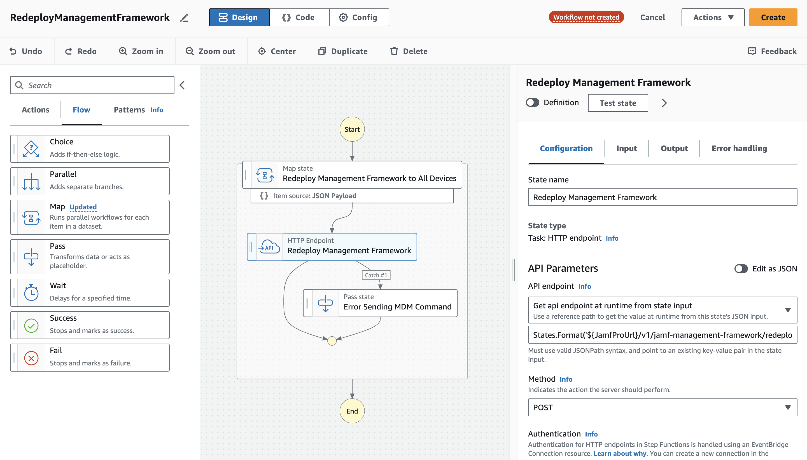

# Jamf Functions

This repository contains CloudFormation templates and Amazon States Language (ASL) files that will create resources in an AWS account to run scheduled and webhook based automations from Jamf Pro. The examples in this project, and the base resources it creates, will then enable you to create _your own_ automations in template form or using AWS Step Functions Workflow Studio.



## Base Resources Template

The base resources template at the root of this project creates resources in your AWS account that are required before you deploy any of the example workflows that are included.

- **API Gateway:** Jamf Pro needs an HTTP endpoint to send webhooks to. The API is created with a long randomized path value to obscure it from discovery (similar to how Slack's inbound webhooks work).
- **Event Bus:** This is a service in AWS that enables messages to be received and then delivered to one or more targets. There is a special logging rule included so a copy of _every_ webhook is saved in CloudWatch logs in case you need to troubleshoot.
- **API Connection:** This securely stores the client ID and secret for your Jamf Pro API client so the Step Functions can make authenticated requests to the Jamf Pro APIs. AWS handles all the token generation and management for you!

> The API Gateway uses a simple implementation of API key authentication. Jamf Pro webhooks support basic authentication with a username and password, or setting a value in custom headers. This approach uses the latter.

### Create a Jamf Pro API Client

You must first create an API client to obtain the client ID and secret values required for the API connection resource. Full instructions are available at the Jamf Learning Hub: [API Roles and Clients](https://learn.jamf.com/en-US/bundle/jamf-pro-documentation-current/page/API_Roles_and_Clients.html).

First create a role by navigating in Jamf Pro to **_Settings > System > API roles and clients_** (you will default to viewing the **_API Roles_** tab) and clicking **_+ New_**. Give the role a name and select all the privileges required for the workflows you will deploy. Click **_Save_**.

Refer to the table below if you are deploying one of the examples. The Jamf Developer Portal also has pages that list the required API privileges for the [Classic API](https://developer.jamf.com/jamf-pro/docs/classic-api-minimum-required-privileges-and-endpoint-mapping) and the [Pro API](https://developer.jamf.com/jamf-pro/docs/privileges-and-deprecations) if you are writing your own custom workflows.

Once you have created the role, create the client by navigating to the **_API Clients_** tab of the **_API roles and clients_** page and clicking **_+ New_**. Give the client a name, select the role you just created, and click the **_Enable API Client_** button. Click **_Save_**.

There will be a **_Generate client secret_** button on the page for your new client (this button will only be active if the client is not disabled). Click it, and click **_Create secret_** on the pop-up. Copy both the client ID and client secret values.

> **You will not be able to retrieve this secret again.** You will have to rotate the secret, generating a new one, which will invalidate the current.

### Deploy the CloudFormation Stack

Download the [base_resources.yaml](./base_resources.yaml) file.

Log into your AWS account and go to the [CloudFormation](https://console.aws.amazon.com/cloudformation/home) console.

Select **_Create stack > With new resources (standard)_**. Choose **_Upload a template file_** and browse for the `base_resource.yaml` file. Fill in the URL of your Jamf Pro server (without a trailing `/`), and the client ID and secret you copied from the previous step.

Click **_Next_**, click **_Next_**, again, and then check all the boxes under "Transforms might require access capabilities" before clicking **_Submit_**. CloudFormation will now create the stack and all the resources.

Once the stack reached the state **_CREATE_COMPLETE_** you can navigate to the **_Outputs_** tab where the values needed for launching the example workflow stacks and creating webhooks will be found.

### Create Jamf Pro Webhooks (As Needed)

You will now need to create the webhooks in Jamf Pro required for the workflows you have created.

Create a webhook in Jamf Pro by navigating to **_Settings > Global > Webhooks_** and clicking **_+ New_**. Git the webhook a name. For **_Webhook URL_** copy the value of **_WebhooksApiUrl_** from the outputs of the base resources CloudFormation stack.

Set the **_Authentication Type_** to **_Header Authentication_**. In the text field you need to paste in the following JSON replacing `<VALUE>` with the value of **_WebhooksApiKey_** from the outputs of the base resources CloudFormation stack.

```json
{
  "x-api-key": "<VALUE>"
}
```

Under **_Content Type_** ensure **_JSON_** is selected and select the appropriate webhook event. For smart group events you have the option of sending only membership changes for a specific group instead of all. 

## Example Workflows

The workflows included with this project are based on published [Jamf Routines](https://learn.jamf.com/en-US/bundle/jamf-routines-documentation/page/jamf_workflow_automation.html). They are effectively Step Functions versions of those automations, and provide a good reference for writing your own.

The API client permissions and webhooks required for each workflow are detailed below:

### Redeploy Management Framework

| Permissions                                     | Webhook                            |
|-------------------------------------------------|------------------------------------|
| Send Computer Remote Command to Install Package | SmartGroupComputerMembershipChange |

### Rename Mobile Devices

| Permissions                                                                   | Webhook              |
|-------------------------------------------------------------------------------|----------------------|
| Read Mobile Devices (< 11.4) <br> Send Mobile Device Set Device Name Command | MobileDeviceEnrolled |

> Jamf Pro 11.4+ includes the management ID in webhooks. Versions before 11.4 require an API call to read the mobile device record and get this value.

### Restart Mobile Devices

| Permissions                                                       | Webhook |
|-------------------------------------------------------------------|---------|
| Read Mobile Devices <br>Send Mobile Device Restart Device Command | n/a     |